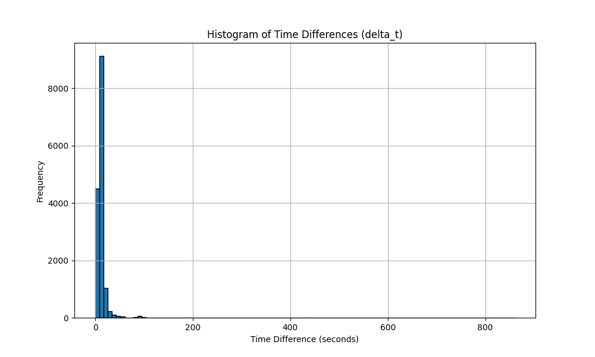

# Task 4: Calculation of Delta t and Histogram Generation

The histogram of time differences `delta_t` between consecutive GPS positions
offers several insights into vessel behavior:

* The majority of time differences are clustered close to zero seconds.
  This indicates that the GPS data points are recorded very frequently,
  with many positions logged within short intervals of each other.
  This high frequency of data points allows for detailed tracking of the vessel's movement.

* There are some occurrences of larger time differences, extending up to 800 seconds.
  These larger intervals are significantly less common but suggest instances where data logging was less frequent
  or where there may have been interruptions in GPS signal reception.